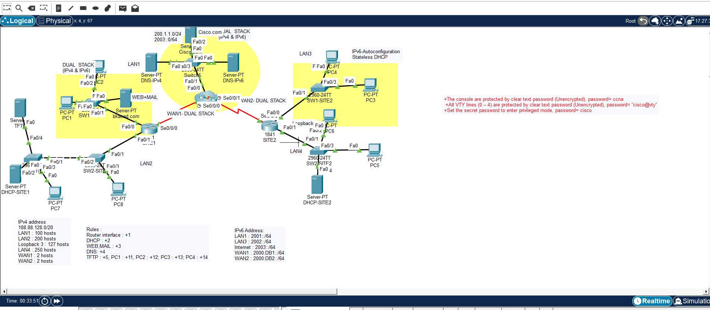
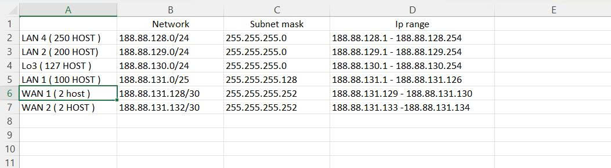

# Subnetting and Network Services Lab

## Topology

## Description
This lab demonstrates basic CCNA networking configuration using Cisco Packet Tracer.

## Features
- IPv4 subnetting
- Router interface configuration
- DHCP configuration
- DNS configuration
- Web Server
- Mail Server
- TFTP configuration
- Console and VTY password security

## Devices Used
- 2 Routers
- 5 
- PCs
- Servers ( Mail, Server, DNS, TFTP )

## Skills Practiced
- Subnetting

- Interface IP configuration
| Device | Interface | IP Address | Subnet Mask |
|------|------|------|------|
| R1 | Fa0/0 | 188.88.131.1 | 255.255.255.128 |
| R1 | Fa0/1 | 188.88.129.1 | 255.255.255.0 |
| PC7 | NIC | DHCP | |
| PC8 | NIC | DHCP | |

- DHCP and DNS setup
- Basic network services
- Router security configuration
## How to Run

1. Download the `.pka` file from this repository
2. Open the file using Cisco Packet Tracer
3. Start the simulation
4. Test connectivity using ping and verify network services
